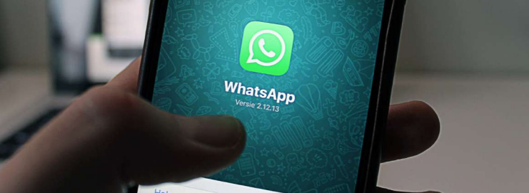

<body>

<h2>Golpes</h2>

<button class="accordion">Golpe do perfil falso no whatsapp</button>

  
                
     

     

     	
Os criminosos vinculam uma imagem de perfil da vítima, geralmente retirada do seu próprio perfil de WhatsApp ou redes sociais. Com uma conta falsa, eles se passam pela vítima e solicitam dinheiro para amigos, familiares e conhecidos.

     

  

  <h4>Como previnir?</h4>
  <ul>
    <li>Ajuste a visualização da imagem da conta do WhatsApp apenas para contatos autorizados;</li>
    <li>Fique atento a mensagens de conhecidos ou familiares solicitando depósito e/ou transferências bancárias (ainda mais se for em nome de terceiros);</li>
    <li>Desconfie de contas com fotos de conhecidos, mas com números diferentes;</li>
  </ul> 
  	<h4>O que fazer?</h4>
    
Registrar um <b>Boletim de Ocorrência</b> e <b>denunciar ao WhatsApp</b> através do e-mail: <a href="mailto:suporte@whatsapp.com?subject=Denúncia">suporte@whatsapp.com</a>. Também é possível denunciar clicando no número do golpe, clicar no campo "Dados do contato" e clicar em "denunciar". Avisar familiares e conhecidos, no caso de detectar que estão utilizando seu nome para aplicar o golpe.

	
* Este golpe não se trata de clonagem de WhatsApp; a vítima não deixa de ter acesso ao seu aplicativo; os criminosos utilizam um número diferente, com a foto da vítima, para se passar por ela.

<button class="accordion">Golpe do voucher/cupom desconto em restaurante</button>

  
TO DO

<button class="accordion">Golpes em plataformas de compra/venda online</button>

  
TO DO

<button class="accordion">Golpe dos falsos links</button>

  
TO DO

<button class="accordion">Golpe do falso intermediador de vendas</button>

  
TO DO

<button class="accordion">Golpe do falso empréstimo</button>

  
TO DO

<button class="accordion">Golpe do amor</button>

  
TO DO

<button class="accordion">Golpe do falso sequestro</button>

  
TO DO

<button class="accordion">Golpe da troca do cartão</button>

  
TO DO

<button class="accordion">Golpe do falso site de leilão</button>

  
TO DO

<button class="accordion">Golpe da sextorsão/nudes</button>

  
TO DO

<button class="accordion">Golpe da clonagem do whatsapp</button>

  
TO DO

<button class="accordion">Golpe do bilhete premiado</button>

  
TO DO

<button class="accordion">Golpe do parente que quebrou o carro</button>

  
TO DO

<button class="accordion">Golpe do depósito com envelope vazio</button>

  
TO DO

<button class="accordion">Golpe da recuperação do veículo furtado</button>

  
TO DO

<button class="accordion">Golpe da falsa ligação do banco</button>

  
TO DO

*Conteúdo produzido com a colaboração de informações das Polícias Civis do Distrito Federal (PC/DF) e do Rio Grande do Sul (PC/RS).

